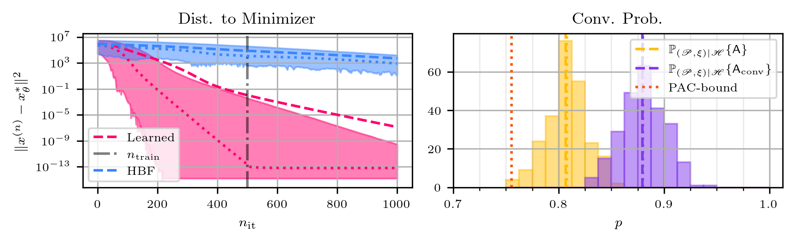
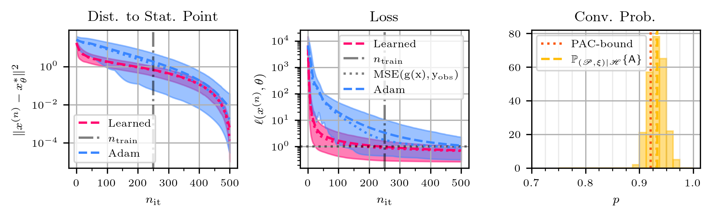

# Convergence of Learned Algorithms
### by Anonymous Author (will be added after decision)
This repository contains code to reproduce the results from our paper 'Convergence of Learned Algorithms to Stationary Points', which can be found, for example, on (left blank for anonymity). 

### Abstract
Convergence in learning-to-optimize is hardly studied, because conventional convergence guarantees in optimization are based on geometric arguments, which cannot be applied easily to learned algorithms. Thus, we develop a probabilistic framework that resembles deterministic optimization and allows for transferring geometric arguments into learning-to-optimize. Our main theorem is a generalization result for parametric classes of potentially non-smooth, non-convex loss functions and establishes the convergence of learned optimization algorithms to stationary points with high probability. This can be seen as a statistical counterpart to the use of geometric safeguards to ensure convergence. To the best of our knowledge, we are the first to prove convergence of optimization algorithms in such a probabilistic framework.

### Experimental Results
1) Experiment on quadratic functions:


2) Neural-network-training experiment:


### Reproducing the Experiments
If you want to reproduce the experiments, you have to adapt the file ```main.py```. In here, you have to specify three variables: ```exp_to_run```, ```path_nn```, and ```path_quad```. 
```exp_to_run``` specifies the experiment, for which you want to reproduce the results on a new test-set. The possible options are ```exp_to_run = 'nn_training'``` for the experiment of training a neural network, and ```exp_to_run = 'quadratics'``` for the experiment on quadratic functions. 
The two variables ```path_nn``` and ```path_quad``` specify, respectively, where the necessary data is stored, that is, the path to the trained model (```model.pt```), the PAC-bound (```pac_bound_conv_prob.npy```), and the number of iterations during training (```n_train.npy```). 
You can find these variables in the corresponding folders ```experiments\<name_of_experiment>\data```. If you run ```main.py``` as described here, then:
  1) A new data set of test functions is created from the same distribution (using `get_data()`).
  2) The evaluation is performed on this new data set. At the end, this will save all the variables needed for creating the plot into the same folder in which the model is stored.
  3) The plots are created (`create_plot()`) by loading the data again.
     
**Note:** In each case, you basically have to solve 2500 optimization problems (number of test functions). This might be time-consuming! Especially, for the neural-network-training experiment, this additionally involves the approximation of stationary points with SGD. If you want to reduce the computational cost here,
you can reduce the number of iterations that are used for approximating stationary points (`num_approx_stat_points`) in the function `compute_data()`, which you can find in `experiments\nn_training\evaluation.py`. This, however, will of course affect the results.
